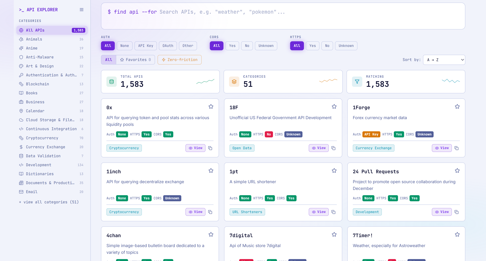
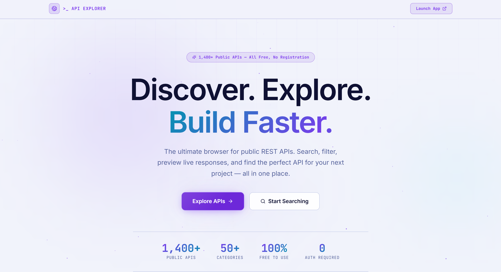
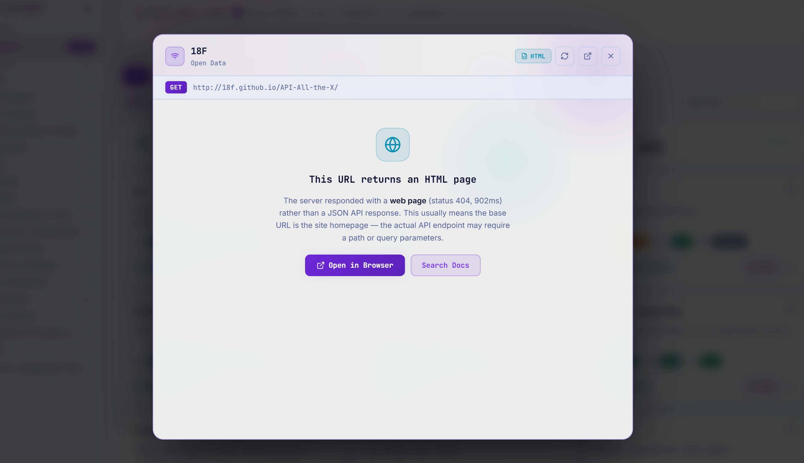

<div align="center">


# &gt;_ API Explorer

**Discover. Explore. Build Faster.**

A beautifully crafted, cosmic-themed browser for 1,400+ free public APIs.  
Search, filter, and preview live API responses — all without leaving your browser.

[](https://muppuriganes.github.io/api-explorer)
[](https://react.dev)
[](https://www.typescriptlang.org)
[](https://vitejs.dev)
[](./LICENSE)

</div>

---

## ✨ Features

| Feature | Description |
|---|---|
| 🌌 **Cosmic Aurora UI** | Deep-space navy + electric violet + cyan — premium dark theme with ambient glow |
| 🃏 **3D Card Hover** | Cards tilt with real perspective as you move your mouse across them |
| 👁️ **Live API Preview** | Click **View** on any card to call the API and see syntax-highlighted JSON in real time |
| 🛡️ **CORS Auto-Retry** | Direct fetch blocked? Automatically retries via a CORS proxy with a status indicator |
| 🌐 **HTML Detection** | Recognises when an endpoint returns an HTML page instead of JSON and shows a friendly notice |
| 🔍 **Fuzzy Search** | Smart relevance-ranked search — finds results even with typos |
| 🗂️ **Category Sidebar** | 50+ categories with icon mapping; drill down instantly |
| ⚡ **Filter Bar** | Filter by Auth type, HTTPS, CORS, or the **Zero-Friction** preset (no auth + CORS + HTTPS) |
| ⭐ **Favorites** | Star any API; persisted in `localStorage` |
| 🚀 **Landing Page** | Animated hero with floating particles, aurora orbs, scrolling ticker & feature showcase |
| 📱 **Responsive** | Full sidebar on desktop; mobile-optimised bottom nav drawer |
| ♿ **Accessible** | Reduced-motion support, ARIA labels, keyboard navigation (`/` to focus search) |

---

## 🖼️ Screenshots

<div align="center">

### 🏠 Landing Page
> Animated aurora background · Floating particles · Live stats · Scrolling category ticker



### 🗂️ Explorer View
> 3D card hover · Category sidebar · Live filter bar · Stats counters



### 👁️ API Preview Modal
> Live JSON fetch · Syntax highlighting · CORS proxy fallback · Response time



</div>

---

## 🚀 Getting Started

### Prerequisites
- **Node.js** ≥ 18
- **npm** ≥ 9

### Installation

```bash
# 1. Clone the repository
git clone https://github.com/muppuriganes/api-explorer.git
cd api-explorer

# 2. Install dependencies
npm install

# 3. Start the development server
npm run dev
```

Open **http://localhost:5173** in your browser.

### Build for Production

```bash
npm run build        # TypeScript check + Vite bundle → dist/
npm run preview      # Preview the production build locally
```

---

## 🎨 Design System

The app uses a **Cosmic Aurora** colour palette — hand-crafted CSS variables, no Tailwind preset colours.

| Token | Dark Mode | Light Mode | Role |
|---|---|---|---|
| `--bg` | `#07080f` | `#f1f3fb` | Page background |
| `--surface` | `#0d0f1d` | `#ffffff` | Card / panel background |
| `--accent` | `#7c3aed` | `#6d28d9` | Electric violet — primary |
| `--accent-2` | `#a78bfa` | `#7c3aed` | Violet highlight |
| `--cyan` | `#22d3ee` | `#0891b2` | Cyan — secondary accent |
| `--ok` | `#10b981` | `#059669` | Success / HTTPS yes |
| `--warn` | `#f59e0b` | `#d97706` | Warning / API key auth |
| `--bad` | `#f43f5e` | `#e11d48` | Error / no HTTPS |

---

## 🏗️ Project Structure

```
api-explorer/
├── src/
│   ├── components/
│   │   ├── ApiCard.tsx          # 3D tilt card with View button
│   │   ├── ApiViewModal.tsx     # Live API preview modal (JSON / CORS / HTML)
│   │   ├── LandingPage.tsx      # Animated marketing landing page
│   │   ├── Hero.tsx             # In-app hero with animated orbs
│   │   ├── SearchBar.tsx        # Terminal-style fuzzy search
│   │   ├── FilterBar.tsx        # Auth / HTTPS / CORS / sort filters
│   │   ├── Sidebar.tsx          # Category navigation
│   │   ├── FilterDrawer.tsx     # Mobile slide-over filters
│   │   ├── StatsCards.tsx       # Animated stat counters with sparklines
│   │   ├── MobileNav.tsx        # Bottom navigation bar
│   │   ├── EmptyState.tsx       # No-results / error states
│   │   ├── Badge.tsx            # Status badges (Auth, HTTPS, CORS)
│   │   └── Chip.tsx             # Filter chip component
│   ├── hooks/
│   │   ├── useApis.ts           # Data fetching + cache logic
│   │   ├── useDebounce.ts       # Input debounce hook
│   │   ├── useFavorites.ts      # localStorage-backed favorites
│   │   ├── useTheme.ts          # Dark / light theme toggle
│   │   ├── useTypewriter.ts     # Terminal typewriter effect
│   │   └── useCountUp.ts        # Animated number counter
│   ├── lib/
│   │   └── fuzzy.ts             # Relevance-ranked fuzzy search scorer
│   ├── App.tsx                  # Root — landing ↔ explorer routing
│   ├── main.tsx                 # React entry point
│   ├── index.css                # All styles (CSS variables + component classes)
│   └── types.ts                 # Shared TypeScript interfaces
├── index.html
├── vite.config.ts
├── tsconfig.json
└── package.json
```

---

## 📡 Data Source

API data is fetched live from the community-maintained **[public-apis/public-apis](https://github.com/public-apis/public-apis)** registry (via `api.publicapis.org`). The app caches results in `sessionStorage` for fast repeat visits and shows a stale-data warning when the network is unavailable.

---

## 🛠️ Tech Stack

| Layer | Technology |
|---|---|
| Framework | **React 18** with functional components & hooks |
| Language | **TypeScript 5.6** — fully typed |
| Build tool | **Vite 6** — instant HMR |
| Styling | **Vanilla CSS** + **Tailwind CSS 4** utility classes |
| Animation | **Framer Motion 11** — page transitions, 3D tilt, orbs |
| Icons | **Lucide React** |

---

## ⌨️ Keyboard Shortcuts

| Key | Action |
|---|---|
| `/` | Focus the search bar |
| `Esc` | Clear search / close modal |

---

## 🤝 Contributing

Contributions, issues and feature requests are welcome!

1. Fork the repository
2. Create your feature branch: `git checkout -b feat/my-feature`
3. Commit your changes: `git commit -m 'feat: add my feature'`
4. Push to the branch: `git push origin feat/my-feature`
5. Open a Pull Request

---

## 📄 License

This project is licensed under the **MIT License** — see the [LICENSE](./LICENSE) file for details.

---

<div align="center">

Made with 💜 by **[muppuriganes](https://github.com/muppuriganes)**

⭐ Star this repo if you found it useful!

</div>
